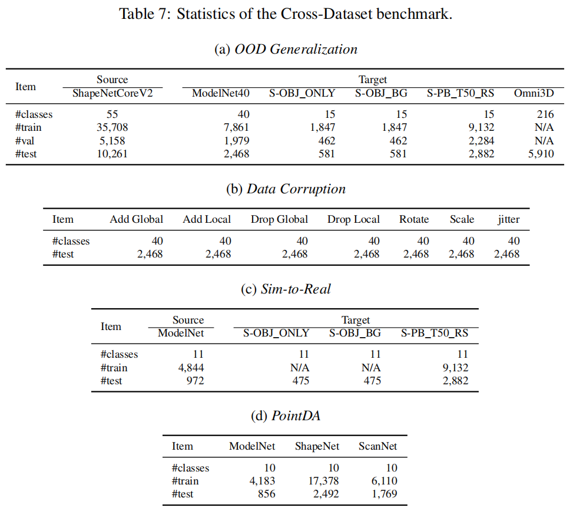

# Point-PRC
This repository is the official implementation of the NeurIPS 2024 paper ["Point-PRC: A Prompt Learning Based Regulation Framework for Generalizable Point Cloud Analysis"](https://openreview.net/forum?id=g7lYP11Erv&noteId=D8t9xZ1y4d).

## Motivation

**Motivation of our research: to promote the
performances on downstream 3D tasks while maintaining good generalization of large 3D models.** The
experiments are conducted on ShapeNetCoreV2. ULIP2 can reach 71.22% zero-shot recognition accuracy on
this dataset. Recent works built on ULIP-2 introduce
lightweight prompt tuning (PT) to further boost target
tasks (75.80% accuracy). However, we observe the improvements come at the expenses of a severe drop in 3D
domain generalization (e.g., 57.07% accuracy on new
classes, much behind 71.22%), and develop a systematic regulation constraint (RC) framework to address
this challenge.

## Introduction

This paper investigates the 3D domain generalization (3DDG) ability of large 3D models based on prevalent prompt learning. Recent works demonstrate the performances of 3D point cloud recognition can be boosted remarkably by parameter-efficient prompt tuning. However, we observe that the improvement on downstream tasks comes at the expense of a severe drop in 3D domain generalization. To resolve this challenge, we present a comprehensive regulation framework that allows the learnable prompts to actively interact with the well-learned general knowledge in large 3D models to maintain good generalization. Specifically, the proposed framework imposes multiple explicit constraints on the prompt learning trajectory by maximizing the mutual agreement between task-specific predictions and task-agnostic knowledge. We design the regulation framework as a plug-and-play module to embed into existing representative large 3D models. Surprisingly, our method not only realizes consistently increasing generalization ability but also enhances task-specific 3D recognition performances across various 3DDG benchmarks by a clear margin. Considering the lack of study and evaluation on 3DDG, we also create three new benchmarks, namely base-to-new, cross-dataset and few-shot generalization benchmarks, to enrich the field and inspire future research.

## Environment
### Package Setup
* [Dassl](https://github.com/KaiyangZhou/Dassl.pytorch)
* Ubuntu 23.10
* Python 3.8.16
* PyTorch 1.12.0
* CUDA 11.6
* torchvision 0.13.0
* timm 0.9.16
* pueue & pueued 2.0.4

```sh
  # option 1: create conda virtual env according to the provided env.yaml
  conda env create -f env.yaml
  codna activate pointprc

  # option 2: create conda virtual env by your own
  conda create -n pointprc python=3.8.16
  codna activate pointprc

  pip install torch==1.12.0+cu116 torchvision==0.13.0+cu116 --extra-index-url https://download.pytorch.org/whl/cu116
```

`pueue` is a shell command management software, we use it for scheduling the model training & evaluation task, please refer to the [official page](https://github.com/Nukesor/pueue) for installation and basic usage. We recommend this tool because under its help you can run the experiments at scale thus save your time.

**NOTE:** We provide a complete package list of our virtual environment in `env.yaml`. Feel free to check whether you need a specific package. 

### Pre-trained Weights
1. In the experiments, we use the following models as the baselines. The pre-trained weights of these models can be found in their public GitHub repositories. 
    * [PointCLIP](https://github.com/ZrrSkywalker/PointCLIP) 
    * [PointCLIP V2](https://github.com/yangyangyang127/PointCLIP_V2)
    * [ULIP](https://github.com/salesforce/ULIP)
    * [ULIP-2](https://github.com/salesforce/ULIP)

## New 3DDG Benchmarks
### _Base-to-new Class Generalization_
1. The datasets used in this benchmark can be downloaded according to the following links.
    - ModelNet40
    - S-OBJ_ONLY
    - S-OBJ_BG
    - S-PB_T50_RS
    - ShapeNetCoreV2

2. The following table shows the statistics of this benchmark

    

### _Cross-dataset Generalization_
1. The datasets used in this benchmark can be downloaded according to the following links.
    - OmniObject3d (Omin3D)
    - ModelNet-C (7 types of corruptions)
        - add global outliers, add local outliers, dropout global structure, dropout local region, rotation, scaling, jittering
    - Sim-to-Real
    - PointDA

2. The following table shows the statistics of this benchmark

    

### _Few-shot Generalization_
1. Although this benchmark contains same datasets as the _Base-to-new Class_, it investigates the model generalization under low-data regime (1, 2, 4, 8, and 16 shots), which is quite different from the evaluation setting of _Base-to-new Class_.

2. The following table shows the statistics of this benchmark

    

## Usage

### _Base-to-new Class Generalization_
1. This part corresponds to the experiments in Section 4.2 (Table 1) and Appendix (Table 9). 

2. To evaluate the performances on this benchmark, you will use `scripts/pointprc/base2new_train.sh` and `scripts/pointprc/base2new_test.sh`. The former trains a model on base classes while the latter evaluates the trained model on new classes. Both scripts have 18 input arguments, as commented in the script file. 

3. Taking S-PB_T50_RS (the hardest split of `ScanObjectNN`) as an example, we train the model on base classes and then evaluate the performance on new classes. 
```sh
    # prompt learning on base classes
    ./scripts/pointprc/base2new_train.sh 0 data/base2new/scanobjectnn scanobjectnn custom_ulip manual64 9 2 2 16 20 hardest full task_perform False False False ulip2 l1_dist

    # test on novel classes
    ./scripts/pointprc/base2new_test.sh 0 data/base2new/scanobjectnn scanobjectnn custom_ulip manual64 9 2 2 16 20 hardest full task_perform False False False ulip2 l1_dist
```

### _Few-shot Generalization_
1. This part corresponds to the experiments in Section 4.4 (Figure 4). 

2. To evaluate the performances on this benchmark, you will use `scripts/pointprc/fewshot_train_eval.sh`. This script also has 18 command-line arguments, as explained in the file. 

3. Taking ShapeNetCoreV2 as an example, we train the model using 1, 2, 4, 8 and 16 shots per class and then evaluate the performance on the whole test set of the dataset. 
```sh
    # train using (1/2/4/8/16)-shot and evaluate on the whole test set
    ./scripts/pointprc/fewshot_train_eval.sh 0 data/fewshot/shapenetcorev2 shapenetcorev2 custom_ulip 9 2 2 1 50 obj_only full task_perform False False False manual64 ulip2 l1_dist
```

### _Cross-dataset Generalization_
1. This part corresponds to the experiments in Section 4.3 (Table 2 and 3) and Appendix (Table 10 and 11). 

2. This benchmark has four types of evaluation settings: _OOD Generalization_, _Data Corruption_, _Sim-to-Real_, and _PointDA_, referring to Table 5 in Appendix of the paper. 

3. To evaluate the performances on _OOD Generalization_ of this benchmark, you will use `scripts/pointprc/xset_test_dg.sh`. This scripts accepts 17 command-line arguments, as explained in the file. 
    - Note that in this setting, **ShapeNetCorev2** serves as the source domain and other four datasets (ModelNet40, S-PB_T50_RS, S-OBJ_BG, S-OBJ_ONLY, Omni3D) act as the target domains. 
    - Since the model has been trained on ShapeNetCoreV2 in the _Few-shot Generalization_ benchmark, when evaluating the performance on a target domain (e.g., Omni3D), we directly load the weights of 16-shot ShapeNetCorev2. 
```sh
    # train using (1/2/4/8/16)-shot and evaluate on the whole test set
    ./scripts/pointprc/xset_test_dg.sh 0 data/xset/omniobject3d omniobject3d shapenetcorev2 12 4 4 50 obj_only full task_perform False False False manual64 ulip2 l1_dist
```

4. To evaluate the performances on other three settings, you can check the following scripts for details.
    - `scripts/pointprc/xset_corrupt.sh` for _Data Corruption_
    - `scripts/pointprc/xset_train_sim2real.sh` and `scripts/pointprc/xset_test_sim2real.sh` for _Sim-to-Real_
    - `scripts/pointprc/xset_train_pointda.sh` and `scripts/pointprc/xset_test_pointda.sh` for  _PointDA_
## Citation
```bibtex
    @inproceedings{sun24point-prc,
        title={Point-PRC: A Prompt Learning Based Regulation Framework for Generalizable Point Cloud Analysis},
        author={Sun, Hongyu and Ke, Qiuhong and Wang, Yongcai and Chen, Wang and Yang, Kang and Li, Deying and Cai, Jianfei},
        booktitle={The Thirty-eighth Annual Conference on Neural Information Processing Systems (NeurIPS)},
        year={2024},
        url={https://openreview.net/forum?id=g7lYP11Erv}
    }
```

## Acknowledgement
Our implementation is partially inspired by the following projects, thanks to their great work

1. [Dassl](https://github.com/KaiyangZhou/Dassl.pytorch)
2. [ULIP](https://github.com/salesforce/ULIP)
3. [PointCLIP](https://github.com/ZrrSkywalker/PointCLIP)
4. [PointCLIP V2](https://github.com/yangyangyang127/PointCLIP_V2)
5. [PromptSRC](https://github.com/muzairkhattak/PromptSRC)

## Contact
If you have any question about our work, please search related issues or create a new one in this repository.